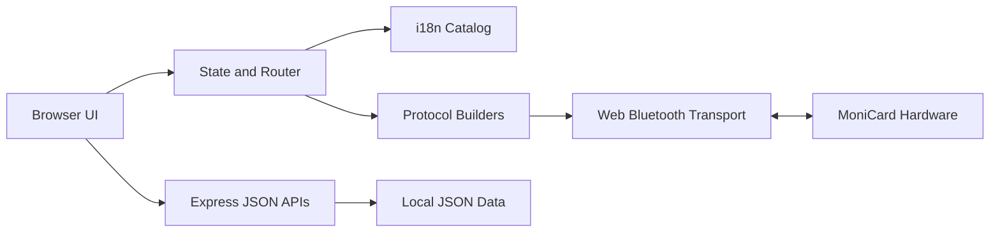

# Architecture

## Overview

MoniCard Web Edition is a client-heavy single-page application served by a small Node.js / Express process.

## Components

### Express server

`server.js` serves static assets, documentation, health information, firmware metadata, and feedback records. It does not proxy Bluetooth communication. BLE remains inside the browser because Web Bluetooth requires a user gesture and browser-managed permission.

### UI and state

`public/app.js` owns hash routing, local state, localStorage persistence, rendering, and feature event handlers. The UI is intentionally dependency-light so protocol experiments are visible and easy to audit.

### Internationalization

`public/i18n.js` contains all user-facing application strings. English is the fallback and default locale. The selected locale is stored in `localStorage` under `monicard-locale`.

### Protocol layer

`public/protocol.js` converts typed operations into binary frames. It must not perform transport or UI work. This boundary makes packet output testable without Bluetooth hardware.

### BLE transport

`public/ble.js` discovers the service, connects to GATT, subscribes to notifications, and serializes chunked writes. It does not infer application-level success from a successful characteristic write.

## Data ownership

- Browser localStorage: selected locale, saved device metadata, control settings, profile text, tags, and cached cards.
- Server `data/`: firmware metadata, content, and feedback records.
- Device: authoritative firmware, serial, battery, storage, received cards, and display assets.

## Trust boundaries

1. File input is untrusted and must not be interpreted as firmware automatically.
2. BLE notifications are untrusted binary input.
3. Device write completion is not equivalent to protocol acknowledgement.
4. JSON API input must be size-limited and validated.
5. Bundled branding assets may have separate redistribution rights.
